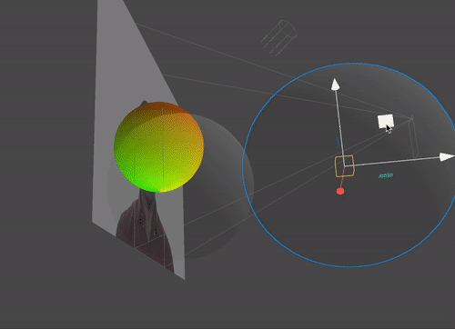

# Vertex displacement fields in Meta Spark

Vertex displacement fields using SparkSL! The shader inputs let you define field size, field falloff, and offset strength. The demo shows two effector fields, but the shader can easily be modified to accomodate more. 
